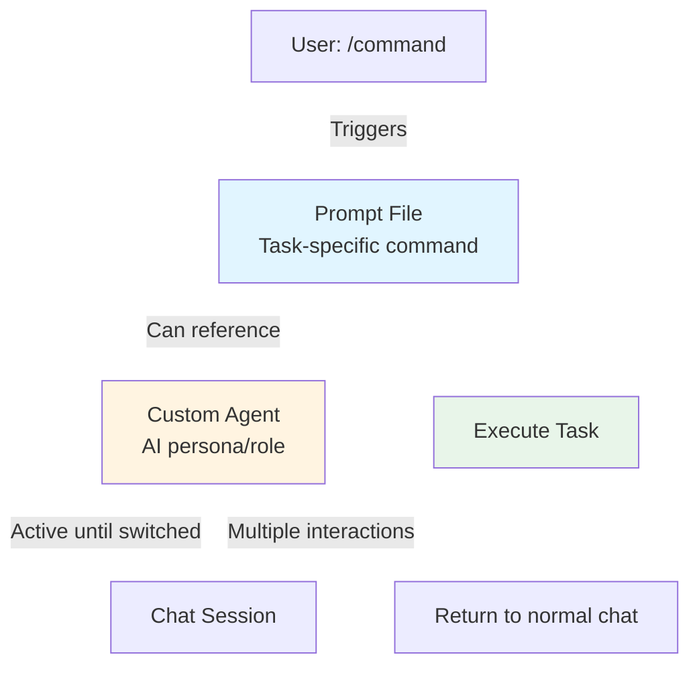

## GitHub CopilotにおけるPrompt FilesとCustom Agentsの違い

ドキュメントより、[prompt files](https://code.visualstudio.com/docs/copilot/customization/prompt-files)と[custom agents](https://code.visualstudio.com/docs/copilot/customization/custom-agents)の主な違いは以下の通りです:

### 目的

**Prompt Files** (`.prompt.md`):

- 特定の1回限りのタスクのための再利用可能なプロンプト
- チャットで`/prompt-name`と入力するとオンデマンドでトリガーされる
- 単一の特定のワークフローを実行(例:「Reactフォームを作成」、「セキュリティレビュー」)

**Custom Agents** (`.agent.md`):

- チャットセッション全体のためのAIペルソナ
- 異なる動作と機能を持つコンテキスト/モードを切り替え
- 特化した役割を定義(例:「Planner」、「Security Reviewer」、「Implementation」)

### スコープ

**Prompt Files**:

- 単一のタスクを実行した後、通常のチャットに戻る
- 再利用可能なコマンドやテンプレートとして考える

**Custom Agents**:

- エージェントを切り替えるまでチャットの動作全体を変更
- 複数のチャットインタラクション間で持続

### 主な機能

**Prompt Files**:

- 入力変数をサポート(`${input:variableName}`)
- Markdownリンクでワークスペースファイルを参照
- どのエージェントがそれらを実行するか指定可能
- `/`コマンドで即座に実行

**Custom Agents**:

- エージェントが利用可能なツールを定義
- エージェント間の遷移のためのハンドオフを含む
- セッション全体を通して永続的な指示を提供
- サブエージェントとして使用可能
- 組織レベルでの共有をサポート

### ファイルの場所

- **Prompt Files**: promptsフォルダ`.github/prompts`
- **Custom Agents**: agentsフォルダ`.github/agents`

```text
.github/
├── agents/
│   └── namespace.your-agent.agent.md     # Custom agent
└── prompts/
    └── namespace.your-command.prompt.md    # Prompt file
```

### 使用例

- **Prompt File**: `/create-react-form`で特定のコンポーネントを生成
- **Custom Agent**: 「Planner」エージェントに切り替えて、編集せずに計画に焦点を当てたすべてのチャットインタラクションを行う

要約:prompt filesはタスク固有のコマンドであり、custom agentsは会話全体のための役割固有のコンテキストです。

## どのように連携するか

**プロンプトファイル内で**、どのエージェントがそれを実行するか指定できます:

```yaml
---
description: 詳細なセキュリティレビューを生成
agent: namespace.your-agent # カスタムエージェントを参照
tools: ["search", "fetch"]
---
ここにプロンプトの指示を記述...
```

### ツールの優先順位

組み合わせた場合、ツールは次の順序で解決されます:

1. プロンプトファイルで指定されたツール
2. 参照されたカスタムエージェントのツール
3. 選択されたエージェントのデフォルトツール

これは、プロンプトファイルが以下を可能にすることを意味します:

- カスタムエージェントの特化した指示と動作を使用
- エージェントのツールリストをオーバーライドまたは拡張
- プロンプトの再利用性とエージェントのペルソナ/コンテキストを組み合わせ

### 関係図



### 使用例

以下のようなものを持つことができます:

- **Custom agent**: セキュリティに焦点を当てた指示を持つ`security-reviewer.agent.md`
- **Prompt file**: security-reviewerエージェントを参照する`/api-review.prompt.md`

`/api-review`を実行すると、セキュリティレビュアーのコンテキストと機能で実行され、タスク固有のプロンプトと役割固有のAI動作の両方が得られます。
