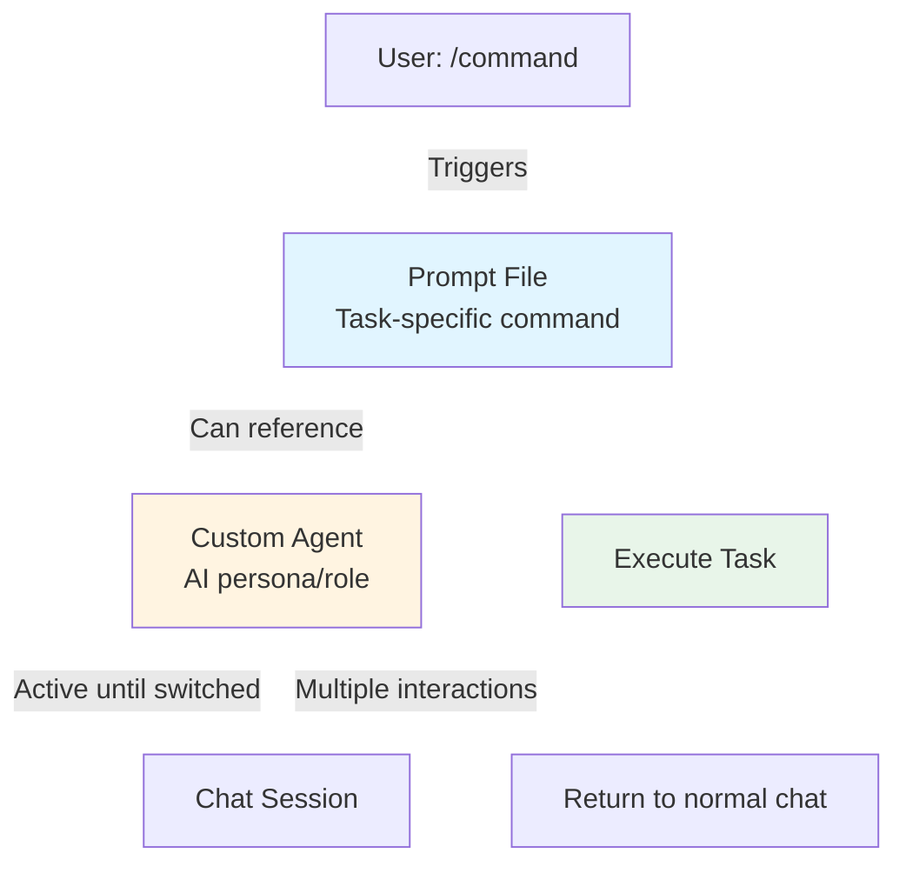

## Prompt Files vs Custom Agents in GitHub Copilot

Based on the documentation, here are the key differences between [prompt files](https://code.visualstudio.com/docs/copilot/customization/prompt-files) and [custom agents](https://code.visualstudio.com/docs/copilot/customization/custom-agents):

### Purpose

**Prompt Files** (`.prompt.md`):

- Reusable prompts for specific one-off tasks
- Triggered on-demand when you type `/prompt-name` in chat
- Execute a single, specific workflow (e.g., "create a React form", "review security")

**Custom Agents** (`.agent.md`):

- AI personas for entire chat sessions
- Switch contexts/modes with different behaviors and capabilities
- Define specialized roles (e.g., "Planner", "Security Reviewer", "Implementation")

### Scope

**Prompt Files**:

- Execute a single task then return to normal chat
- Think of them as reusable commands or templates

**Custom Agents**:

- Change the entire behavior of chat until you switch agents
- Persist across multiple chat interactions

### Key Features

**Prompt Files**:

- Support input variables (`${input:variableName}`)
- Reference workspace files with Markdown links
- Can specify which agent runs them
- Execute immediately with `/` commands

**Custom Agents**:

- Define available tools for the agent
- Include handoffs to transition between agents
- Provide persistent instructions throughout session
- Can be used as subagents
- Support organization-level sharing

### File Location

- **Prompt Files**: prompts folder `.github/prompts`
- **Custom Agents**: agents folder `.github/agents`

```text
.github/
├── agents/
│   └── namespace.your-agent.agent.md     # Custom agent
└── prompts/
    └── namespace.your-command.prompt.md    # Prompt file
```

### Use Case Examples

- **Prompt File**: `/create-react-form` to generate a specific component
- **Custom Agent**: Switch to "Planner" agent to have all your chat interactions focus on planning without making edits

In summary: prompt files are task-specific commands, while custom agents are role-specific contexts for entire conversations.

## How They Work Together

**In a prompt file**, you can specify which agent runs it:

```yaml
---
description: Generate a detailed security review
agent: namespace.your-agent # References your custom agent
tools: ["search", "fetch"]
---
Your prompt instructions here...
```

### Tool Priority

When combining them, tools are resolved in this order:

1. Tools specified in the prompt file
2. Tools from the referenced custom agent
3. Default tools for the selected agent

This means a prompt file can:

- Use a custom agent's specialized instructions and behavior
- Override or extend the agent's tool list
- Combine the reusability of prompts with the persona/context of agents

### Relationship Diagram



### Example Use Case

You could have:

- **Custom agent**: `security-reviewer.agent.md` with security-focused instructions
- **Prompt file**: `/api-review.prompt.md` that references the security-reviewer agent

When you run `/api-review`, it executes with the security reviewer's context and capabilities, giving you both task-specific prompts and role-specific AI behavior.
