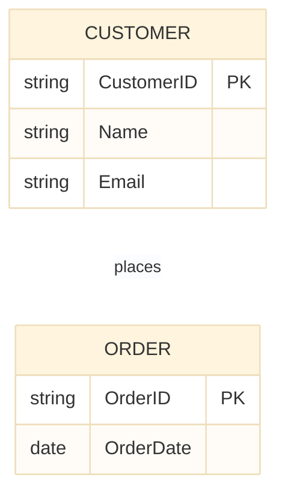

## データベース設計におけるEntity-Relationship（ER）図

Entity-Relationship (ER)図は、データベースシステム内のデータとその関係を視覚的に表現したものです。データ構造をモデル化し、ステークホルダー間のコミュニケーションを促進するために、データベース設計で広く使用されています。

ER図は、エンティティ、属性、リレーションシップの3つの主要なコンポーネントをモデル化します。

## エンティティ

- 実世界のオブジェクトや概念を表します（例:Customer、Order、Product）
- ER図では矩形として描かれます
- 強いエンティティ（独立して存在する）または弱いエンティティ（他のエンティティに依存する）に分類できます
- 例:"Customer"エンティティは、CustomerID、Name、Emailなどの属性を持つ場合があります。
- 主キーは各エンティティインスタンスを一意に識別します。
- 例:CustomerIDはCustomerエンティティの主キーです。
- 外部キーはエンティティ間の関係を確立します。
- 例:"Order"エンティティは、CustomerエンティティのCustomerIDを参照する外部キーを持つ場合があります。

## 属性

- エンティティのプロパティまたは特性を記述します（例:Name、Address、Price）
- ER図では、各エンティティに接続された楕円として描かれます
- 単純（原子的）または複合（複数の属性で構成される）にできます
- 単一値または多値にできます
- 例:"Employee"エンティティは、"FirstName"と"LastName"で構成される複合属性"FullName"を持つ場合があります。
- 例:"PhoneNumbers"属性は多値にでき、単一のエンティティに複数の電話番号を許可します。
- 他の属性から計算される導出属性を持つことができます
- 例:"Age"属性は"DateOfBirth"属性から導出できます。

## リレーションシップ

- エンティティ間の関連を表します（例:CustomerがOrderをplacesする）
- ER図では、関連するエンティティに接続されたダイヤモンドとして描かれます
- リレーションシップ自体を記述する属性を持つことができます（例:OrderDate）
- 例:"Employee"と"Department"エンティティ間の"WorksFor"リレーションシップは、"StartDate"という属性を持つ場合があります。
- カーディナリティは、あるエンティティのインスタンスが別のエンティティのインスタンスに関連付けられる数を定義します
- カーディナリティのタイプには、1対1（1:1）、1対多（1:N）、多対多（M:N）が含まれます
- 例:"Customer"と"Order"間の1対多のリレーションシップは、1人の顧客が複数の注文を行うことができることを示します。
- 参加制約は、すべてのエンティティインスタンスがリレーションシップに参加するか、一部のみが参加するかを示します
- 例:"Professor"と"Course"間の"Teaches"リレーションシップで、すべての教授が少なくとも1つのコースを教えなければならない場合、それはProfessorエンティティの全参加です。

## ER図の例

このER図は、"Customer"と"Order"エンティティ間の1対多のリレーションシップを示しており、各顧客が複数の注文を行うことができます。"CustomerID"はCustomerエンティティの主キーとして機能し、"OrderID"はOrderエンティティの主キーです。"places"というリレーションシップが2つのエンティティを接続し、顧客が注文を行うことができることを示しています。
