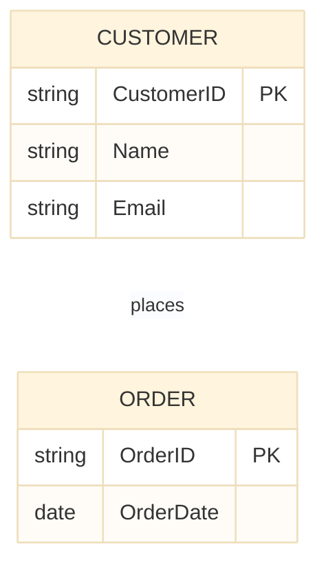

## Entity-Relationship (ER) Diagrams in Database Design

Entity-Relationship (ER) diagrams are a visual representation of the data and its relationships within a database system. They are widely used in database design to model the structure of data and to facilitate communication between stakeholders.

ER diagrams model three main components: entities, attributes, and relationships.

## Entities

- Represent real-world objects or concepts (e.g., Customer, Order, Product)
- Depicted as rectangles in ER diagrams
- Can be classified as strong entities (exist independently) or weak entities (depend on other entities)
- Example: A "Customer" entity may have attributes like CustomerID, Name, and Email.
- Primary keys uniquely identify each entity instance.
- Example: CustomerID is the primary key for the Customer entity.
- Foreign keys establish relationships between entities.
- Example: An "Order" entity may have a foreign key referencing the CustomerID from the Customer entity.

## Attributes

- Describe properties or characteristics of entities (e.g., Name, Address, Price)
- Depicted as ovals connected to their respective entities in ER diagrams
- Can be simple (atomic) or composite (made up of multiple attributes)
- Can be single-valued or multi-valued
- Example: An "Employee" entity may have a composite attribute "FullName" consisting of "FirstName" and "LastName".
- Example: A "PhoneNumbers" attribute may be multi-valued, allowing multiple phone numbers for a single entity.
- Can have derived attributes calculated from other attributes
- Example: An "Age" attribute can be derived from the "DateOfBirth" attribute.

## Relationships

- Represent associations between entities (e.g., Customer places Order)
- Depicted as diamonds connected to the related entities in ER diagrams
- Can have attributes that describe the relationship itself (e.g., OrderDate)
- Example: A "WorksFor" relationship between "Employee" and "Department" entities may have an attribute "StartDate".
- Cardinality defines the number of instances of one entity that can be associated with instances of another entity
- Types of cardinality include one-to-one (1:1), one-to-many (1:N), and many-to-many (M:N)
- Example: A one-to-many relationship between "Customer" and "Order" indicates that one customer can place multiple orders.
- Participation constraints indicate whether all or only some entity instances participate in a relationship
- Example: In a "Teaches" relationship between "Professor" and "Course", if all professors must teach at least one course, it is total participation for the Professor entity.

## Example ER Diagram

This ER diagram illustrates a one-to-many relationship between the "Customer" and "Order" entities, where each customer can place multiple orders. The "CustomerID" serves as the primary key for the Customer entity, while the "OrderID" is the primary key for the Order entity. The relationship "places" connects the two entities, indicating that customers can place orders.
